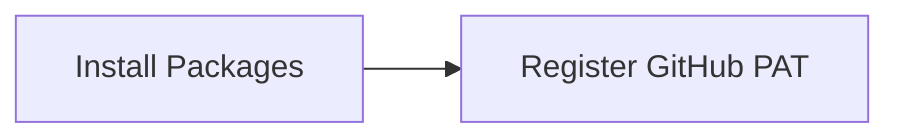

This tutorial complements `01_stakeholder_github_setup.R` and unpacks the workshop on github onboarding for course. You will see how it advances the Stakeholder Analysis sequence while building confidence with base R and tidyverse tooling.

## Setup

- Ensure you have opened the `archr` project root (or set your working directory there) before running any code.
- Open the workshop script in RStudio so you can execute lines interactively with `Ctrl+Enter` or `Cmd+Enter`.
- Create a fresh R session to avoid conflicts with leftover objects from earlier workshops.

## Skills

- Navigate the script `01_stakeholder_github_setup.R` within the Stakeholder Analysis module.
- Connect the topic "GitHub onboarding for course" to systems architecting decisions.
- Install any required packages highlighted with `install.packages()`.

## Process Overview




## Application

### Step 1 – Install Packages

Install credentials package. Install credentials so the rest of the workshop can run.

```{r step_01, eval=FALSE}
install.packages("credentials")
```

### Step 2 – Register GitHub PAT

Set github personal-access-token (PAT).

```{r step_02, eval=FALSE}
credentials::set_github_pat()
```

## Learning Checks


**Learning Check 1.** Which packages do you install in Step 1, and what must you verify before moving on?

<details>
<summary>Show answer</summary>

Step 1 installs credentials, so make sure each package finishes installing without errors before continuing.

</details>

**Learning Check 2.** Why is Step 2 (‘Register GitHub PAT’) necessary in this guide?

<details>
<summary>Show answer</summary>

Set github personal-access-token (PAT).

</details>

**Learning Check 3.** Which script should you keep open while running this guide?

<details>
<summary>Show answer</summary>

Navigate the script `01_stakeholder_github_setup.R` within the Stakeholder Analysis module.

</details>
