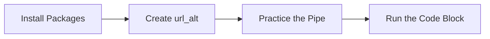

This tutorial complements `10_architecting_ahp_archr_demo.R` and unpacks the workshop on ahp with archr demo. You will see how it advances the Architecting Systems sequence while building confidence with base R and tidyverse tooling.

## Setup

- Ensure you have opened the `archr` project root (or set your working directory there) before running any code.
- Open the workshop script in RStudio so you can execute lines interactively with `Ctrl+Enter` or `Cmd+Enter`.
- Create a fresh R session to avoid conflicts with leftover objects from earlier workshops.

## Skills

- Navigate the script `10_architecting_ahp_archr_demo.R` within the Architecting Systems module.
- Connect the topic "AHP with archr demo" to systems architecting decisions.
- Install any required packages highlighted with `install.packages()`.
- Load packages with `library()` and verify they attach without warnings.
- Import data files with `readr` helpers and inspect the resulting objects.
- Chain tidyverse verbs with `%>%` to explore stakeholder or architecture tables.

## Process Overview




## Application

### Step 1 – Install Packages

Install it. Install workshops/archr_1.0.tar.gz, source so the rest of the workshop can run.

```{r step_01, eval=FALSE}
install.packages("workshops/archr_1.0.tar.gz", type = "source")
```

### Step 2 – Load Packages

Load the archr package.

```{r step_02, eval=FALSE}
library(archr)
library(dplyr)
library(readr)
```

### Step 3 – Create `url_alt`

Use archr's get_sheet function.

```{r step_03, eval=FALSE}
url_alt = get_sheet(
  docid = "1oLixfbnuep9p3purhJUDSdyW6YeGbXaujk6gU1ibaGg", 
  gid = "0")
```

### Step 4 – Create `url_cri`

Create the object `url_cri` so you can reuse it in later steps.

```{r step_04, eval=FALSE}
url_cri = get_sheet(
  docid = "1oLixfbnuep9p3purhJUDSdyW6YeGbXaujk6gU1ibaGg",
  gid = "837220618"
)
```

### Step 5 – Import CSV Data

Load the CSV file into a tibble you can explore in R.

```{r step_05, eval=FALSE}
alts = url_alt %>% read_csv()
cri = url_cri %>% read_csv()
alts
cri
```

### Step 6 – Practice the Pipe

Use the `%>%` operator to pass each result to the next tidyverse verb.

```{r step_06, eval=FALSE}
alts %>% head(5)
alts %>% slice(1:5)
```

### Step 7 – Create `ahp`

Create the object `ahp` so you can reuse it in later steps.

```{r step_07, eval=FALSE}
ahp = get_ahp(
  alternatives = alts,
  criteria = cri)
```

### Step 8 – Run the Code Block

Execute the block and pay attention to the output it produces.

```{r step_08, eval=FALSE}
ahp$summary
ahp$consistency
```

## Learning Checks


**Learning Check 1.** Which packages do you install in Step 1, and what must you verify before moving on?

<details>
<summary>Show answer</summary>

Step 1 installs source, so make sure each package finishes installing without errors before continuing.

</details>

**Learning Check 2.** Which libraries does Step 2 attach, and why do you run that chunk before others?

<details>
<summary>Show answer</summary>

It attaches archr, dplyr and readr, ensuring their functions are available before you execute the downstream code.

</details>

**Learning Check 3.** After Step 3, what does `url_alt` capture?

<details>
<summary>Show answer</summary>

It creates `url_alt`. Use archr's get_sheet function.

</details>

**Learning Check 4.** After Step 4, what does `url_cri` capture?

<details>
<summary>Show answer</summary>

It creates `url_cri`. Create the object `url_cri` so you can reuse it in later steps.

</details>
