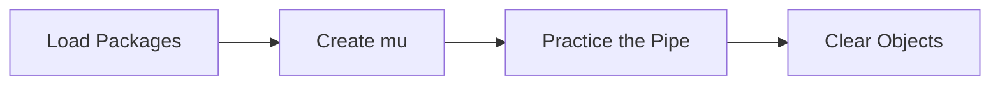

This tutorial complements `22_evaluation_failure_rates.R` and unpacks the workshop on failure rates primer. You will see how it advances the Evaluation sequence while building confidence with base R and tidyverse tooling.

## Setup

- Ensure you have opened the `archr` project root (or set your working directory there) before running any code.
- Open the workshop script in RStudio so you can execute lines interactively with `Ctrl+Enter` or `Cmd+Enter`.
- Create a fresh R session to avoid conflicts with leftover objects from earlier workshops.

## Skills

- Navigate the script `22_evaluation_failure_rates.R` within the Evaluation module.
- Connect the topic "Failure rates primer" to systems architecting decisions.
- Load packages with `library()` and verify they attach without warnings.
- Chain tidyverse verbs with `%>%` to explore stakeholder or architecture tables.
- Iterate on visualisations built with `ggplot2`.

## Process Overview




## Application

### Step 1 – Load Packages

Load necessary libraries. Attach dplyr to make its functions available.

```{r step_01, eval=FALSE}
library(dplyr)
library(ggplot2)
```

### Step 2 – Create `products`

Lifespan Distribution: distribution (PDF) for a vector of product lifespans. Reflects the probability that a product failed after X hours or years Eg. Here's a vector of 10 items' lifespans, in hours.

```{r step_02, eval=FALSE}
products = c(24, 273, 41, 282, 14, 210, 325, 276, 96, 149)
```

### Step 3 – Practice the Pipe

Use the `%>%` operator to pass each result to the next tidyverse verb.

```{r step_03, eval=FALSE}
products %>% hist()
```

### Step 4 – Practice the Pipe

Use the `%>%` operator to pass each result to the next tidyverse verb.

```{r step_04, eval=FALSE}
products %>% density() %>% plot()
```

### Step 5 – Start a ggplot

Initialize a ggplot so you can layer geoms and customise aesthetics.

```{r step_05, eval=FALSE}
ggplot() +
  geom_density(data = tibble(products), mapping = aes(x = products))
```

### Step 6 – Create `mu`

Mean Time to Failure: the mean of a lifespan distribution. Describes the average hours to failure per unit. Eg. let's get the MTTF for our products' life distribution.

```{r step_06, eval=FALSE}
mu = mean(products)
```

### Step 7 – Run the Code Block

Execute the block and pay attention to the output it produces.

```{r step_07, eval=FALSE}
mu
```

### Step 8 – Create `lambda`

Failure Rate (Lambda): inverse of mean time to failure. Describes the average number of times a product fails per time-step (eg. per hour). Eg. let's get the Failure Rate for our products' life distribution.

```{r step_08, eval=FALSE}
lambda = 1 / mean(products)
lambda
```

### Step 9 – Run the Code Block

Exponential Distribution: a common form for lifespan distributions, characterized by one parameter, lambda. If you have lambda, you can get the MTTF. Eg. what's the cumulative probability of a product failing at or before 100 hours, given an Exp. Distr. with MTTF mu?

```{r step_09, eval=FALSE}
pexp(100, rate = 1/mu)
```

### Step 10 – Run the Code Block

Probability of Failure F(t): cumulative probability of failure by time t. expcdf() will give you F(t) in an exponential distribution. Probability of Reliability/Survival R(t): cumulative probability it DOESN'T fail by time t. For example, R(t = 100) = 1 - expcdf(100, mu). Eg. what's the cumulative probability of product survives for 100 hours, given an Exp. Distr. with MTTF mu?

```{r step_10, eval=FALSE}
1 - pexp(100, rate = 1/mu)
```

### Step 11 – Practice the Pipe

Take a random sample!

```{r step_11, eval=FALSE}
rexp(n = 1000, rate = 1 / mu) %>% hist()
```

### Step 12 – Practice the Pipe

Use the `%>%` operator to pass each result to the next tidyverse verb.

```{r step_12, eval=FALSE}
rexp(n = 1000, rate = 1 / mu) %>% density() %>% plot()
```

### Step 13 – Create `data`

Create the object `data` so you can reuse it in later steps.

```{r step_13, eval=FALSE}
data = tibble(t = rexp(n = 1000, rate = 1 / mu))
ggplot() +
  geom_density(data = data, mapping = aes(x = t))
```

### Step 14 – Start a ggplot

Initialize a ggplot so you can layer geoms and customise aesthetics.

```{r step_14, eval=FALSE}
ggplot() +
  geom_density(data = data, mapping = aes(x = t))
```

### Step 15 – Clear Objects

Cleanup! Remove objects from the environment to prevent name clashes.

```{r step_15, eval=FALSE}
rm(list = ls())
```

## Learning Checks


**Learning Check 1.** Which libraries does Step 1 attach, and why do you run that chunk before others?

<details>
<summary>Show answer</summary>

It attaches dplyr and ggplot2, ensuring their functions are available before you execute the downstream code.

</details>

**Learning Check 2.** After Step 2, what does `products` capture?

<details>
<summary>Show answer</summary>

It creates `products`. Lifespan Distribution: distribution (PDF) for a vector of product lifespans. Reflects the probability that a product failed after X hours or years Eg. Here's a vector of 10 items' lifespans, in hours.

</details>

**Learning Check 3.** After Step 6, what does `mu` capture?

<details>
<summary>Show answer</summary>

It creates `mu`. Mean Time to Failure: the mean of a lifespan distribution. Describes the average hours to failure per unit. Eg. let's get the MTTF for our products' life distribution.

</details>

**Learning Check 4.** After Step 8, what does `lambda` capture?

<details>
<summary>Show answer</summary>

It creates `lambda`. Failure Rate (Lambda): inverse of mean time to failure. Describes the average number of times a product fails per time-step (eg. per hour). Eg. let's get the Failure Rate for our products' life distribution.

</details>
