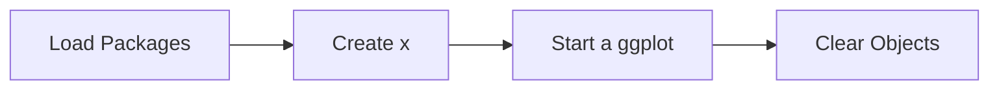

This tutorial complements `23_evaluation_learning_curves.R` and unpacks the workshop on learning curve analysis. You will see how it advances the Evaluation sequence while building confidence with base R and tidyverse tooling.

## Setup

- Ensure you have opened the `archr` project root (or set your working directory there) before running any code.
- Open the workshop script in RStudio so you can execute lines interactively with `Ctrl+Enter` or `Cmd+Enter`.
- Create a fresh R session to avoid conflicts with leftover objects from earlier workshops.

## Skills

- Navigate the script `23_evaluation_learning_curves.R` within the Evaluation module.
- Connect the topic "Learning curve analysis" to systems architecting decisions.
- Load packages with `library()` and verify they attach without warnings.
- Chain tidyverse verbs with `%>%` to explore stakeholder or architecture tables.
- Iterate on visualisations built with `ggplot2`.

## Process Overview




## Application

### Step 1 – Load Packages

Learning Curves ########################################### Load packages.

```{r step_01, eval=FALSE}
library(dplyr)
library(ggplot2)
```

### Step 2 – Create `s`

Learning Curve Formula: Y = aX^b suppose a 80% learning curve.

```{r step_02, eval=FALSE}
s <- 0.80
```

### Step 3 – Create `gains`

means each time quantity doubles, you gain 20% in efficiency.

```{r step_03, eval=FALSE}
gains <- 1 - s
```

### Step 4 – Create `b`

Calculate the slope of the learning curve.

```{r step_04, eval=FALSE}
b <- log(s) / log(2.00)
```

### Step 5 – Create `a`

If it takes 30 hours to make tool A at the beginning...

```{r step_05, eval=FALSE}
a <- 30
```

### Step 6 – Create `x`

What happens if we make tool A many times?

```{r step_06, eval=FALSE}
x <- c(1, 2, 5, 10, 20, 50, 100, 150, 200)
```

### Step 7 – Create `y`

Our slope suggests that the average time to make Tool A becomes...

```{r step_07, eval=FALSE}
y <- a * x^b
y
```

### Step 8 – Create `data`

Let's plot that learning curve!

```{r step_08, eval=FALSE}
data = tibble(x, y)
```

### Step 9 – Start a ggplot

Visualize it! Initialize a ggplot so you can layer geoms and customise aesthetics.

```{r step_09, eval=FALSE}
ggplot() +
  geom_line(data = data, mapping = aes(x = x, y = y)) +
  labs(x = "Number of times made (X)", y = "Average time (Y) to make Tool A")
```

### Step 10 – Create `data2`

Create the object `data2` so you can reuse it in later steps.

```{r step_10, eval=FALSE}
data2 = bind_rows(
  tibble(
    a = 30,
    x = c(1, 2, 5, 10, 20, 50, 100, 150, 200),
    s = 0.80,
    y = a * x^ (log(s) / log(2.00))
  ),
  tibble(
    a = 30,
    x = c(1, 2, 5, 10, 20, 50, 100, 150, 200),
    s = 0.90,
    y = a * x^ (log(s) / log(2.00))
  )
)
```

### Step 11 – Start a ggplot

Initialize a ggplot so you can layer geoms and customise aesthetics.

```{r step_11, eval=FALSE}
ggplot() +
  geom_line(data = data2, 
            mapping = aes(
              x = x, y = y,
              group = s, color = s)) +
  labs(x = "Number of times made (X)",
       y = "Average time (Y) to make Tool A")
```

### Step 12 – Practice the Pipe

Use the `%>%` operator to pass each result to the next tidyverse verb.

```{r step_12, eval=FALSE}
data3 = tibble(s = c(0.80, 0.85, 0.90, 0.92, 0.97, 0.99)) %>%
  # For each s...
  group_by(s) %>%
  # Make this vector!
  reframe(
    a = 30,
    x = c(1, 2, 5, 10, 20, 50, 100, 150, 200),
    y = a * x^ (log(s) / log(2.00))    
  )
```

### Step 13 – Run the Code Block

View it! Execute the block and pay attention to the output it produces.

```{r step_13, eval=FALSE}
data3
```

### Step 14 – Start a ggplot

Visualize it! Initialize a ggplot so you can layer geoms and customise aesthetics.

```{r step_14, eval=FALSE}
ggplot() +
  # Let's make color = factor(s)
  # That splits the colors into a discrete color scale
  geom_line(data = data3, 
            mapping = aes(
              x = x, y = y,
              group = s, color = factor(s) )) +
  labs(x = "Number of times made (X)",
       y = "Average time (Y) to make Tool A")
```

### Step 15 – Clear Objects

Z. Done! Clear environment.

```{r step_15, eval=FALSE}
rm(list = ls())
```

## Learning Checks


**Learning Check 1.** Which libraries does Step 1 attach, and why do you run that chunk before others?

<details>
<summary>Show answer</summary>

It attaches dplyr and ggplot2, ensuring their functions are available before you execute the downstream code.

</details>

**Learning Check 2.** After Step 2, what does `s` capture?

<details>
<summary>Show answer</summary>

It creates `s`. Learning Curve Formula: Y = aX^b suppose a 80% learning curve.

</details>

**Learning Check 3.** After Step 3, what does `gains` capture?

<details>
<summary>Show answer</summary>

It creates `gains`. means each time quantity doubles, you gain 20% in efficiency.

</details>

**Learning Check 4.** After Step 4, what does `b` capture?

<details>
<summary>Show answer</summary>

It creates `b`. Calculate the slope of the learning curve.

</details>
