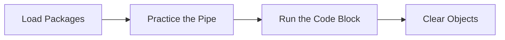

This tutorial complements `25_evaluation_net_present_value.R` and unpacks the workshop on net present value calculations. You will see how it advances the Evaluation sequence while building confidence with base R and tidyverse tooling.

## Setup

- Ensure you have opened the `archr` project root (or set your working directory there) before running any code.
- Open the workshop script in RStudio so you can execute lines interactively with `Ctrl+Enter` or `Cmd+Enter`.
- Create a fresh R session to avoid conflicts with leftover objects from earlier workshops.

## Skills

- Navigate the script `25_evaluation_net_present_value.R` within the Evaluation module.
- Connect the topic "Net present value calculations" to systems architecting decisions.
- Load packages with `library()` and verify they attach without warnings.
- Chain tidyverse verbs with `%>%` to explore stakeholder or architecture tables.
- Iterate on visualisations built with `ggplot2`.

## Process Overview




## Application

### Step 1 – Load Packages

Setup #####################################################. Attach dplyr to make its functions available.

```{r step_01, eval=FALSE}
library(dplyr)
library(ggplot2)
```

### Step 2 – Create `t`

Create a data frame,.

```{r step_02, eval=FALSE}
t = tibble(
  time = 1:5,      # Time periods
  # supposing a fixed annual cost and return...
  benefit = 30000, # Annual benefits
  cost = 5000,     # Annual costs
  # Where the funds lose 5% in value each year...
  discount = 0.05  # Discount rate
)
```

### Step 3 – Run the Code Block

Execute the block and pay attention to the output it produces.

```{r step_03, eval=FALSE}
t
```

### Step 4 – Practice the Pipe

Calculate net revenue. Use the `%>%` operator to pass each result to the next tidyverse verb.

```{r step_04, eval=FALSE}
t = t %>% 
  mutate(netrev = benefit - cost)
t
```

### Step 5 – Practice the Pipe

Calculate net present value for each time.

```{r step_05, eval=FALSE}
t = t %>% 
  mutate(npv = netrev / (1 + discount)^time)
```

### Step 6 – Run the Code Block

Execute the block and pay attention to the output it produces.

```{r step_06, eval=FALSE}
t
```

### Step 7 – Run the Code Block

View the results. Execute the block and pay attention to the output it produces.

```{r step_07, eval=FALSE}
t
```

### Step 8 – Start a ggplot

Plotting NPV over time.

```{r step_08, eval=FALSE}
ggplot(t, aes(x = time, y = npv)) +       
  geom_point() +
  labs(x = "Time", y = "Net Present Value") +
  ggtitle("Net Present Value Over Time")
```

### Step 9 – Clear Objects

Cleanup. Remove objects from the environment to prevent name clashes.

```{r step_09, eval=FALSE}
rm(list= ls())
```

## Learning Checks


**Learning Check 1.** Which libraries does Step 1 attach, and why do you run that chunk before others?

<details>
<summary>Show answer</summary>

It attaches dplyr and ggplot2, ensuring their functions are available before you execute the downstream code.

</details>

**Learning Check 2.** After Step 2, what does `t` capture?

<details>
<summary>Show answer</summary>

It creates `t` that builds a tibble of scenario data. Create a data frame,.

</details>

**Learning Check 3.** When you run the ggplot code in Step 8, what insight should the figure provide?

<details>
<summary>Show answer</summary>

It should visualise the transformation described in the step, highlighting how you plotting npv over time.

</details>

**Learning Check 4.** Why is Step 3 (‘Run the Code Block’) necessary in this guide?

<details>
<summary>Show answer</summary>

Execute the block and pay attention to the output it produces.

</details>
