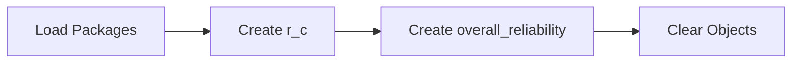

This tutorial complements `26_evaluation_system_reliability.R` and unpacks the workshop on system reliability evaluation. You will see how it advances the Evaluation sequence while building confidence with base R and tidyverse tooling.

## Setup

- Ensure you have opened the `archr` project root (or set your working directory there) before running any code.
- Open the workshop script in RStudio so you can execute lines interactively with `Ctrl+Enter` or `Cmd+Enter`.
- Create a fresh R session to avoid conflicts with leftover objects from earlier workshops.

## Skills

- Navigate the script `26_evaluation_system_reliability.R` within the Evaluation module.
- Connect the topic "System reliability evaluation" to systems architecting decisions.
- Load packages with `library()` and verify they attach without warnings.

## Process Overview




## Application

### Step 1 – Load Packages

Setup ################################################### Load Packages!

```{r step_01, eval=FALSE}
library(dplyr)
library(ggplot2)
```

### Step 2 – Create `r_a`

Suppose at time t = 100 hours...

```{r step_02, eval=FALSE}
r_a = 0.88
r_b = 0.99
r_c = 0.95
# 82% chance that the whole system stays reliable for 100 hours
r_a * r_b * r_c
```

### Step 3 – Create `t`

My coffee shop's system has 3 serially-connected components: A = coffee maker (MTTF = 500 hours) B = bean grinder (MTTF = 5000 hours) C = dishwasher (MTTF = 1000 hours) What's the probability the system survives 100 hours?

```{r step_03, eval=FALSE}
t <- 100
```

### Step 4 – Create `r_a`

Reliability of A (coffee maker) by time t R_a(t) = 1 - F_a(t).

```{r step_04, eval=FALSE}
r_a <- 1 - pexp(t, rate = 1/500)
```

### Step 5 – Create `r_b`

Reliability of B (bean grinder) by time t.

```{r step_05, eval=FALSE}
r_b <- 1 - pexp(t, rate = 1/5000)
```

### Step 6 – Create `r_c`

Reliability of C (dishwasher) by time t.

```{r step_06, eval=FALSE}
r_c <- 1 - pexp(t, rate = 1/1000)
```

### Step 7 – Create `r_s`

Reliability of System by time t = 100.

```{r step_07, eval=FALSE}
r_s <- r_a * r_b * r_c
r_s
```

### Step 8 – Create `r_a1`

Suppose we buy 3 coffee makers - as long as one works, we can maintain the system.

```{r step_08, eval=FALSE}
r_a1 <- r_a
r_a2 <- r_a
r_a3 <- r_a
```

### Step 9 – Create `r_a_parallel`

Let's find chance at least 1 remains functional.

```{r step_09, eval=FALSE}
r_a_parallel <- 1 - prod(1 - c(r_a1, r_a2, r_a3))
r_a_parallel
```

### Step 10 – Run the Code Block

If series. Execute the block and pay attention to the output it produces.

```{r step_10, eval=FALSE}
r_a1 * r_a2 * r_a3
```

### Step 11 – Create `overall_reliability`

We could compute the reliability of the overall system at time t like so!

```{r step_11, eval=FALSE}
overall_reliability <- r_a_parallel * r_b * r_c
overall_reliability
```

### Step 12 – Create `cpu`

Create the object `cpu` so you can reuse it in later steps.

```{r step_12, eval=FALSE}
cpu = 0.99
keys = 0.98
keys2 = 0.999999999999
display = 0.96
mouse = 0.95
# Reliability of your system is just 88%
cpu * keys * display * mouse
```

### Step 13 – Run the Code Block

Two keys = 86%.

```{r step_13, eval=FALSE}
cpu * keys^2 * display * mouse
```

### Step 14 – Run the Code Block

All keys = 40%.

```{r step_14, eval=FALSE}
cpu * keys^40 * display * mouse
```

### Step 15 – Run the Code Block

All keys = 40%.

```{r step_15, eval=FALSE}
cpu * keys2^40 * display * mouse
```

### Step 16 – Clear Objects

Cleanup. Remove objects from the environment to prevent name clashes.

```{r step_16, eval=FALSE}
rm(list = ls())
```

## Learning Checks


**Learning Check 1.** Which libraries does Step 1 attach, and why do you run that chunk before others?

<details>
<summary>Show answer</summary>

It attaches dplyr and ggplot2, ensuring their functions are available before you execute the downstream code.

</details>

**Learning Check 2.** After Step 2, what does `r_a` capture?

<details>
<summary>Show answer</summary>

It creates `r_a`. Suppose at time t = 100 hours...

</details>

**Learning Check 3.** After Step 3, what does `t` capture?

<details>
<summary>Show answer</summary>

It creates `t`. My coffee shop's system has 3 serially-connected components: A = coffee maker (MTTF = 500 hours) B = bean grinder (MTTF = 5000 hours) C = dishwasher (MTTF = 1000 hours) What's the probability the system survives 100 hours?

</details>

**Learning Check 4.** After Step 5, what does `r_b` capture?

<details>
<summary>Show answer</summary>

It creates `r_b`. Reliability of B (bean grinder) by time t.

</details>
