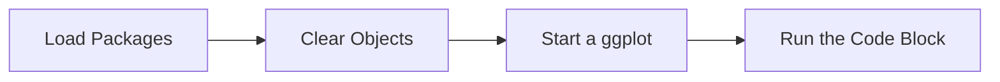

This tutorial complements `29_evaluation_risk_modeling.R` and unpacks the workshop on risk modeling tutorial. You will see how it advances the Evaluation sequence while building confidence with base R and tidyverse tooling.

## Setup

- Ensure you have opened the `archr` project root (or set your working directory there) before running any code.
- Open the workshop script in RStudio so you can execute lines interactively with `Ctrl+Enter` or `Cmd+Enter`.
- Create a fresh R session to avoid conflicts with leftover objects from earlier workshops.

## Skills

- Navigate the script `29_evaluation_risk_modeling.R` within the Evaluation module.
- Connect the topic "Risk modeling tutorial" to systems architecting decisions.
- Load packages with `library()` and verify they attach without warnings.
- Chain tidyverse verbs with `%>%` to explore stakeholder or architecture tables.
- Iterate on visualisations built with `ggplot2`.

## Process Overview




## Application

### Step 1 – Load Packages

PACKAGES ###############################. Attach dplyr to make its functions available.

```{r step_01, eval=FALSE}
library(dplyr)
library(readr)
```

### Step 2 – Create `cost`

Cost distribution stats ($1000s) by subsystem.

```{r step_02, eval=FALSE}
cost = tribble(
  ~type, ~system, ~dist,    ~mu, ~sigma,
  "cost", "app",  "normal", 40,  2,
  "cost", "mak",  "exponential", 30,  NA,
  "cost", "dec",  "normal", 60,  4,
  "cost", "qc",  "poisson", 20,  NA,
  "cost", "del",  "normal", 80,  5
)
```

### Step 3 – Create `time`

Time distribution stats (hours) by subsystem.

```{r step_03, eval=FALSE}
time <- tribble(
  ~type, ~system, ~dist,        ~mu, ~sigma,
  "time", "app",  "normal",      500,   25,
  "time", "mak",  "exponential", 1500,  NA,
  "time", "dec",  "normal",      400,   25,
  "time", "qc",   "poisson",     1200,  NA,
  "time", "del",  "normal",      1300,  30
)
```

### Step 4 – Run the Code Block

1.1 We know the stats of the App Subsystem's Time distribution view the app row - it's a normal distribution.

```{r step_04, eval=FALSE}
time
```

### Step 5 – Practice the Pipe

grab stats 's'. Use the `%>%` operator to pass each result to the next tidyverse verb.

```{r step_05, eval=FALSE}
s = time %>% filter(system == "app")
```

### Step 6 – Run the Code Block

Execute the block and pay attention to the output it produces.

```{r step_06, eval=FALSE}
s$mu # access the mean ("mu")  
s$sigma  # access the standard deviation ("sigma")
```

### Step 7 – Create `bench`

Get Quantities of Interest Set benchmark 'bench'.

```{r step_07, eval=FALSE}
bench = 520;
```

### Step 8 – Clear Objects

Eg. What # of cases took exactly 520 hours to make "app"? -- P(x = 520) = ???

```{r step_08, eval=FALSE}
dnorm(bench, mean = s$mu, sd = s$sigma)
```

### Step 9 – Clear Objects

-- Eg. What # of cases took <= 520 hours?

```{r step_09, eval=FALSE}
pnorm(bench, mean = s$mu, sd = s$sigma)
```

### Step 10 – Clear Objects

What # of cases took MORE than 520 hours?

```{r step_10, eval=FALSE}
1 - pnorm(bench, mean = s$mu, sd = s$sigma)
```

### Step 11 – Practice the Pipe

Probability of failure (failure = more than 520 hours)!

```{r step_11, eval=FALSE}
time %>% mutate(prob = 1 - pnorm(bench, mean = mu, sd = sigma))
```

### Step 12 – Practice the Pipe

Joint probability of failure.

```{r step_12, eval=FALSE}
p = time %>% 
  mutate(prob = case_when(
    # when normal...
    dist == "normal" ~  1 - pnorm(bench, mean = mu, sd = sigma),
    dist == "exponential" ~ 1 - pexp(bench, rate = 1 / mu),
    dist == "poisson" ~ 1 - ppois(bench, lambda = mu),
    # otherwise
    TRUE ~ NA
  ))
```

### Step 13 – Practice the Pipe

Use the `%>%` operator to pass each result to the next tidyverse verb.

```{r step_13, eval=FALSE}
p %>% summarize(joint = prod(prob))
```

### Step 14 – Run the Code Block

Execute the block and pay attention to the output it produces.

```{r step_14, eval=FALSE}
p
```

### Step 15 – Create `n`

Let's get 100 values...

```{r step_15, eval=FALSE}
n = 100;
```

### Step 16 – Create `p1`

Create the object `p1` so you can reuse it in later steps.

```{r step_16, eval=FALSE}
p1 = tibble(
  bench = bench,
  x = seq(from = 420, to = 560, length.out = 100),
  fill = x < bench,
  prob = dnorm(x, mean = s$mu, sd = s$sigma)
)
```

### Step 17 – Start a ggplot

Initialize a ggplot so you can layer geoms and customise aesthetics.

```{r step_17, eval=FALSE}
ggplot() +
  geom_point(data = p1, mapping = aes(x = x, y = prob))
```

### Step 18 – Start a ggplot

Initialize a ggplot so you can layer geoms and customise aesthetics.

```{r step_18, eval=FALSE}
ggplot() +
  geom_area(data = p1, mapping = aes(x = x, y = prob))
ggplot() +
  geom_line(data = p1, mapping = aes(x = x, y = prob))
```

### Step 19 – Start a ggplot

Initialize a ggplot so you can layer geoms and customise aesthetics.

```{r step_19, eval=FALSE}
ggplot() +
  geom_area(data = p1, mapping = aes(x = x, y = prob)) +
  geom_line(data = p1, mapping = aes(x = x, y = prob), color = "steelblue", size = 2)
```

### Step 20 – Start a ggplot

Initialize a ggplot so you can layer geoms and customise aesthetics.

```{r step_20, eval=FALSE}
ggplot() +
  geom_area(data = p1, mapping = aes(x = x, y = prob, fill = fill))
```

### Step 21 – Start a ggplot

Initialize a ggplot so you can layer geoms and customise aesthetics.

```{r step_21, eval=FALSE}
ggplot() +
  geom_area(data = p1, mapping = aes(x = x, y = prob, fill = fill))
```

### Step 22 – Create `p2`

Create the object `p2` so you can reuse it in later steps.

```{r step_22, eval=FALSE}
p2 = tibble(
  bench = bench,
  x = seq(from = 420, to = 560, length.out = 100),
  fill = x < bench,
  prob = dnorm(x, mean = s$mu, sd = s$sigma),
  # Cumulative probability
  cprob = pnorm(x, mean = s$mu, sd = s$sigma),
  # random values
  sim = rnorm(x, mean = s$mu, sd = s$sigma)
)
```

### Step 23 – Start a ggplot

Initialize a ggplot so you can layer geoms and customise aesthetics.

```{r step_23, eval=FALSE}
ggplot() +
  geom_area(data = p2, mapping = aes(x = x, y = cprob, fill = fill))
```

### Step 24 – Practice the Pipe

Use the `%>%` operator to pass each result to the next tidyverse verb.

```{r step_24, eval=FALSE}
p2 %>% 
  select(sim)
```

### Step 25 – Start a ggplot

Initialize a ggplot so you can layer geoms and customise aesthetics.

```{r step_25, eval=FALSE}
ggplot() +
  geom_histogram(data = p2, mapping = aes(x = sim), fill = "steelblue", color = "black")
```

### Step 26 – Start a ggplot

Initialize a ggplot so you can layer geoms and customise aesthetics.

```{r step_26, eval=FALSE}
ggplot() +
  geom_histogram(data = p2, mapping = aes(x = sim), fill = "steelblue", color = "black")
```

### Step 27 – Start a ggplot

Initialize a ggplot so you can layer geoms and customise aesthetics.

```{r step_27, eval=FALSE}
ggplot() +
  geom_histogram(data = p2, mapping = aes(x = sim), fill = "#023402", color = "black")
```

### Step 28 – Start a ggplot

Initialize a ggplot so you can layer geoms and customise aesthetics.

```{r step_28, eval=FALSE}
ggplot() +
  geom_density(data = p2, mapping = aes(x = sim), fill = "#023402", color = "black")
```

### Step 29 – Run the Code Block

Execute the block and pay attention to the output it produces.

```{r step_29, eval=FALSE}
colors()
```

## Learning Checks


**Learning Check 1.** Which libraries does Step 1 attach, and why do you run that chunk before others?

<details>
<summary>Show answer</summary>

It attaches dplyr and readr, ensuring their functions are available before you execute the downstream code.

</details>

**Learning Check 2.** After Step 2, what does `cost` capture?

<details>
<summary>Show answer</summary>

It creates `cost` that builds a tibble of scenario data. Cost distribution stats ($1000s) by subsystem.

</details>

**Learning Check 3.** After Step 3, what does `time` capture?

<details>
<summary>Show answer</summary>

It creates `time` that builds a tibble of scenario data. Time distribution stats (hours) by subsystem.

</details>

**Learning Check 4.** After Step 5, what does `s` capture?

<details>
<summary>Show answer</summary>

It creates `s` that filters rows to the cases of interest, and threads the result through a dplyr pipeline. grab stats 's'. Use the `%>%` operator to pass each result to the next tidyverse verb.

</details>
