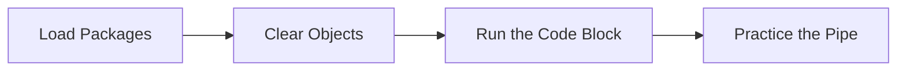

This tutorial complements `31_evaluation_probability_solutions.R` and unpacks the workshop on probability solutions key. You will see how it advances the Evaluation sequence while building confidence with base R and tidyverse tooling.

## Setup

- Ensure you have opened the `archr` project root (or set your working directory there) before running any code.
- Open the workshop script in RStudio so you can execute lines interactively with `Ctrl+Enter` or `Cmd+Enter`.
- Create a fresh R session to avoid conflicts with leftover objects from earlier workshops.

## Skills

- Navigate the script `31_evaluation_probability_solutions.R` within the Evaluation module.
- Connect the topic "Probability solutions key" to systems architecting decisions.
- Load packages with `library()` and verify they attach without warnings.
- Chain tidyverse verbs with `%>%` to explore stakeholder or architecture tables.
- Iterate on visualisations built with `ggplot2`.

## Process Overview




## Application

### Step 1 – Load Packages

Load required libraries. Attach dplyr to make its functions available.

```{r step_01, eval=FALSE}
library(dplyr)
library(readr)
library(ggplot2)
```

### Step 2 – Create `cost`

Import data! Cost distribution stats ($1000s) by subsystem.

```{r step_02, eval=FALSE}
cost = tribble(
  ~type, ~system, ~dist,    ~mu, ~sigma,
  "cost", "app",  "normal", 40,  2,
  "cost", "mak",  "exponential", 30,  NA,
  "cost", "dec",  "normal", 60,  4,
  "cost", "qc",  "poisson", 20,  NA,
  "cost", "del",  "normal", 80,  5
)
```

### Step 3 – Create `time`

Time distribution stats (hours) by subsystem.

```{r step_03, eval=FALSE}
time <- tribble(
  ~type, ~system, ~dist,        ~mu, ~sigma,
  "time", "app",  "normal",      500,   25,
  "time", "mak",  "exponential", 1500,  NA,
  "time", "dec",  "normal",      400,   25,
  "time", "qc",   "poisson",     1200,  NA,
  "time", "del",  "normal",      1300,  30
)
```

### Step 4 – Create `bench`

EXAMPLE 1: PROBABILISTIC PROJECTIONS ########################################### Set parameters.

```{r step_04, eval=FALSE}
bench <- 520 # suppose 520 hours is our firm deadline from funders
```

### Step 5 – Clear Objects

Eg. What % of cases would should we expect take > 520 hours? Assume a normal distribution.

```{r step_05, eval=FALSE}
1 - pnorm(bench, mean = 500, sd = 20)
```

### Step 6 – Run the Code Block

What if an exponential distribution fit this better? The rate (lambda) of an exponential distribution is 1 / mean time.

```{r step_06, eval=FALSE}
1 - pexp(bench, rate = 1/500)
```

### Step 7 – Run the Code Block

What if a poisson distribution fit this better? The lambda of a poisson distribution is the **mean** time.

```{r step_07, eval=FALSE}
1 - ppois(bench, lambda = 500)
```

### Step 8 – Clear Objects

100 random draws if normal.......

```{r step_08, eval=FALSE}
rnorm(n = 100, mean = 500, sd = 25)
```

### Step 9 – Run the Code Block

Quality Control. Execute the block and pay attention to the output it produces.

```{r step_09, eval=FALSE}
time
# -- mu: 1200 hours
# -- poisson
# -- 1A. What % of its possible architectures take OVER 600 hours?
```

### Step 10 – Create `bench`

Create the object `bench` so you can reuse it in later steps.

```{r step_10, eval=FALSE}
bench = 600
1 - ppois(bench, lambda = 500)
```

### Step 11 – Run the Code Block

-- 1B. Take a 100 random draws from that distribution, and view its histogram!

```{r step_11, eval=FALSE}
rpois(n = 100, lambda = 500)
```

### Step 12 – Practice the Pipe

Use the `%>%` operator to pass each result to the next tidyverse verb.

```{r step_12, eval=FALSE}
rpois(n = 100, lambda = 500) %>% hist()
```

### Step 13 – Clear Objects

Delivery System -- 1A. What % of its possible architectures take OVER 600 hours?

```{r step_13, eval=FALSE}
1 - pnorm(600, mean = 1300, sd = 30)
```

### Step 14 – Practice the Pipe

-- 1B. Take a 100 random draws from that distribution, and view its histogram!

```{r step_14, eval=FALSE}
rnorm(n = 100, mean = 1300, sd = 30) %>% hist()
```

### Step 15 – Create `o`

Create the object `o` so you can reuse it in later steps.

```{r step_15, eval=FALSE}
o <- tibble(
  app = rnorm(n = 1000, mean = 500, sd = 25),
  mak = rexp(n = 1000, rate = 1 / 1500),
  dec = rnorm(n = 1000, mean = 400, sd = 25),
  qc = rpois(n = 1000, lambda = 1200),
  del = rnorm(n = 1000, mean = 1300, sd = 30)
)
```

### Step 16 – Practice the Pipe

Use the `%>%` operator to pass each result to the next tidyverse verb.

```{r step_16, eval=FALSE}
o %>%
  mutate(id = 1:n()) %>%
  group_by(id) %>%
  mutate(max = max(c(app, mak, dec, qc, del)))
```

### Step 17 – Practice the Pipe

Use the `%>%` operator to pass each result to the next tidyverse verb.

```{r step_17, eval=FALSE}
o %>%
  rowwise() %>%
  mutate(max = max(c(app, mak, dec, qc, del)))
```

### Step 18 – Practice the Pipe

Use the `%>%` operator to pass each result to the next tidyverse verb.

```{r step_18, eval=FALSE}
o %>%
  rowwise() %>%
  mutate(sum = sum(c(app, mak, dec, qc, del)))
```

### Step 19 – Practice the Pipe

Use the `%>%` operator to pass each result to the next tidyverse verb.

```{r step_19, eval=FALSE}
o = o %>%
  rowwise() %>%
  mutate(max = max(c(app, mak, dec, qc, del))) %>%
  mutate(sum = sum(c(app, mak, dec, qc, del)))
```

### Step 20 – Run the Code Block

Execute the block and pay attention to the output it produces.

```{r step_20, eval=FALSE}
o
```

### Step 21 – Practice the Pipe

Get max. Use the `%>%` operator to pass each result to the next tidyverse verb.

```{r step_21, eval=FALSE}
o = o %>% 
  rowwise() %>%
  mutate(max = max(c(app, mak, dec, qc, del)))
```

### Step 22 – Practice the Pipe

Get total. Use the `%>%` operator to pass each result to the next tidyverse verb.

```{r step_22, eval=FALSE}
o = o %>% 
  rowwise() %>%
  mutate(sum = sum(c(app, mak, dec, qc, del)))
```

### Step 23 – Start a ggplot

2.3 Compute Quantities of Interest View the histogram / approximate the PDF!

```{r step_23, eval=FALSE}
ggplot(o, aes(x = sum)) +
  geom_histogram(binwidth = 100, fill = "green", color = "black") +
  labs(x = "System Completion Time (hours)", y = "Frequency")
```

### Step 24 – Start a ggplot

Initialize a ggplot so you can layer geoms and customise aesthetics.

```{r step_24, eval=FALSE}
ggplot(o, aes(x = max)) +
  geom_histogram(binwidth = 100, fill = "purple", color = "black") +
  labs(x = "Max Subsystem Completion Time (hours)", y = "Frequency")
```

### Step 25 – Run the Code Block

Compute the median, mean, and standard deviation of this distribution! If simultaneously...

```{r step_25, eval=FALSE}
median(o$max)
mean(o$max)
sd(o$max)
```

### Step 26 – Run the Code Block

"If sequentially... Execute the block and pay attention to the output it produces.

```{r step_26, eval=FALSE}
median(o$sum)
mean(o$sum)
sd(o$sum)
```

### Step 27 – Run the Code Block

Suppose we have an 1800-hour deadline. What's the chance it takes >1800 hours if done **simultaneously**?

```{r step_27, eval=FALSE}
1 - ppois(1800, lambda = mean(o$max))
```

### Step 28 – Run the Code Block

TASK 2: SIMULATE OVERALL SYSTEM Try your best to repeat this process, but this time, simulate the **TOTAL COST** of the system overall, using our table t above!

```{r step_28, eval=FALSE}
cost
```

### Step 29 – Create `k`

Create the object `k` so you can reuse it in later steps.

```{r step_29, eval=FALSE}
k = tibble(
  app = rnorm(n = 1000, mean = 40, sd = 2),
  mak = rexp(n = 1000, rate = 1 / 30),
  dec = rnorm(n = 1000, mean = 60, sd = 4),
  qc = rpois(n = 1000, lambda = 20),
  del = rnorm(n = 1000, mean = 80, sd = 5)
)
```

### Step 30 – Practice the Pipe

Use the `%>%` operator to pass each result to the next tidyverse verb.

```{r step_30, eval=FALSE}
k %>% 
  rowwise() %>% 
  mutate(sum = sum(c(app:del)))
```

### Step 31 – Practice the Pipe

If you need to do it without using specific values.

```{r step_31, eval=FALSE}
cost %>%
  group_by(system) %>%
  reframe(
    id = 1:n(),
    sim = case_when(
    dist == "normal" ~ rnorm(n = 1000, mean = mu, sd = sigma),
    dist == "exponential" ~ rexp(n = 1000, rate = 1 / mu),
    dist == "poisson" ~ rpois(n = 1000, lambda = mu)
  ))
```

### Step 32 – Create `p`

EXAMPLE 3: SIMULATING DISCRETE DISTRIBUTIONS Let's say in the Donut Cannon Subsystem, every cannon has the same reliability (p = 95%).

```{r step_32, eval=FALSE}
p <- 0.95
# If we have n donuts we want to launch...
n <- 10
# We can calculate using a binomial distribution PDF quantities of interest
```

### Step 33 – Run the Code Block

3.1 What's the probability that 9 out of 10 land successfully?

```{r step_33, eval=FALSE}
dbinom(9, size = n, prob = p)
```

### Step 34 – Run the Code Block

3.2 What's the probability that at least 9 land successfully?

```{r step_34, eval=FALSE}
pbinom(9, size = n, prob = p)
```

### Step 35 – Run the Code Block

more than 9. Execute the block and pay attention to the output it produces.

```{r step_35, eval=FALSE}
1 - pbinom(9, size = n, prob = p)
```

### Step 36 – Practice the Pipe

3.3 What's the expected number of donuts that land safely?

```{r step_36, eval=FALSE}
rbinom(100, n, p) %>% mean()
rbinom(100, n, p) %>% sd()
```

## Learning Checks


**Learning Check 1.** Which libraries does Step 1 attach, and why do you run that chunk before others?

<details>
<summary>Show answer</summary>

It attaches dplyr, readr and ggplot2, ensuring their functions are available before you execute the downstream code.

</details>

**Learning Check 2.** After Step 2, what does `cost` capture?

<details>
<summary>Show answer</summary>

It creates `cost` that builds a tibble of scenario data. Import data! Cost distribution stats ($1000s) by subsystem.

</details>

**Learning Check 3.** After Step 3, what does `time` capture?

<details>
<summary>Show answer</summary>

It creates `time` that builds a tibble of scenario data. Time distribution stats (hours) by subsystem.

</details>

**Learning Check 4.** After Step 4, what does `bench` capture?

<details>
<summary>Show answer</summary>

It creates `bench`. EXAMPLE 1: PROBABILISTIC PROJECTIONS ########################################### Set parameters.

</details>
