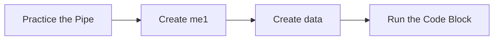

This tutorial complements `37_evaluation_main_effects_lab.R` and unpacks the workshop on main effects lab. You will see how it advances the Evaluation sequence while building confidence with base R and tidyverse tooling.

## Setup

- Ensure you have opened the `archr` project root (or set your working directory there) before running any code.
- Open the workshop script in RStudio so you can execute lines interactively with `Ctrl+Enter` or `Cmd+Enter`.
- Create a fresh R session to avoid conflicts with leftover objects from earlier workshops.

## Skills

- Navigate the script `37_evaluation_main_effects_lab.R` within the Evaluation module.
- Connect the topic "Main effects lab" to systems architecting decisions.
- Load packages with `library()` and verify they attach without warnings.
- Chain tidyverse verbs with `%>%` to explore stakeholder or architecture tables.
- Define custom functions to package repeatable logic.
- Iterate on visualisations built with `ggplot2`.

## Process Overview




## Application

### Step 1 – Practice the Pipe

Enumerate Architectures Example from Slides in Class.

```{r step_01, eval=FALSE}
data = enumerate_sf(n = c(2, 3, 2)) %>%
  # Add metrics
  mutate(m1 = c(33,73, 40, 80, 30, 70, 66, 146, 80, 160, 60, 140),
         m2 = c(0.8910, 0.9801, 0.8991, 0.9890, 0.4500, 0.4950, 0.9899, 0.9998, 0.9900, 0.9999, 0.7425, 0.7499))
```

### Step 2 – Run the Code Block

Execute the block and pay attention to the output it produces.

```{r step_02, eval=FALSE}
data
```

### Step 3 – Define `me()`

Calculate main effect. Create the helper function `me()` so you can reuse it throughout the workshop.

```{r step_03, eval=FALSE}
me = function(data, decision = "d2", value = 1, metric = "m1"){
  # Testing values
  # decision = "d2"; value = 1; metric = "m1"
  data2 = data %>%
    # Grab any columns with these character strings as their column names
    select(any_of(c(alt = decision, metric = metric))) %>%
    # Add a decision column
    mutate(decision = decision) %>%
    # Reorder them
    select(decision, alt, metric)
  # Calculate effect
  data3 = data2 %>%
    summarize(
      xhat = mean(metric[alt == value], na.rm = TRUE),
      x = mean(metric[alt != value], na.rm = TRUE),
      dbar = xhat - x  
    )
  output = data3$dbar
```

### Step 4 – Run the Code Block

Execute the block and pay attention to the output it produces.

```{r step_04, eval=FALSE}
  return(output)
}
```

### Step 5 – Create `me1`

Get main effects for each level.

```{r step_05, eval=FALSE}
me1 = me(data, decision = "d2", value = 1, metric = "m1")
me2 = me(data, decision = "d2", value = 0, metric = "m1")
me3 = me(data, decision = "d2", value = 2, metric = "m1")
```

### Step 6 – Run the Code Block

Calculate sensitivity. Execute the block and pay attention to the output it produces.

```{r step_06, eval=FALSE}
(abs(me1) + abs(me2) + abs(me3)) / 3
```

### Step 7 – Run the Code Block

I'd suggest you use the final versions of these functions developed in: 00_sensitivity_connectivity_utilities.R.

```{r step_07, eval=FALSE}
source("workshops/00_sensitivity_connectivity_utilities.R")
```

### Step 8 – Run the Code Block

Let's try using this function to get sensitivity scores for every decision and metric.

```{r step_08, eval=FALSE}
sensitivity(data, decision_i = "d1", metric = "m1")
connectivity(data, decision_i = "d3", decisions = c("d1", "d2", "d3"), metric = "m1")
```

### Step 9 – Load Packages

Attach dplyr to make its functions available.

```{r step_09, eval=FALSE}
library(dplyr)
library(ggplot2)
```

### Step 10 – Create `data`

Create the object `data` so you can reuse it in later steps.

```{r step_10, eval=FALSE}
data = tibble(
  decision = c("D1", "D2", "D3", "D1", "D2", "D3"),
  sensitivity = c(5, 20, 30, 5, 10, 15),
  connectivity = c(8, 30, 20, 2, 5, 30),
  metric = c("cost", "cost", "cost", "benefit", "benefit", "benefit")
) %>%
  mutate(metric = case_when(
    metric == "cost" ~ "Cost (USD)",
    metric == "benefit" ~ "Range (Mi)"
  ))
```

### Step 11 – Create `quandrants`

Create the object `quandrants` so you can reuse it in later steps.

```{r step_11, eval=FALSE}
quandrants = tibble(
  label = c("Q1", "Q2", "Q3", "Q4"),
  sensitivity = c(18, 18, 12, 12),
  connectivity = c(18, 12,18,  12)
)
```

### Step 12 – Practice the Pipe

Use the `%>%` operator to pass each result to the next tidyverse verb.

```{r step_12, eval=FALSE}
divisions = data %>%
  summarize(sensitivity = (max(sensitivity) - 0) / 2,
            connectivity = (max(connectivity) - 0) / 2 )
```

### Step 13 – Create `gg`

Create the object `gg` so you can reuse it in later steps.

```{r step_13, eval=FALSE}
gg = ggplot() +
  # Plot points
  geom_point(
    data = data, 
    mapping = aes(
      x = connectivity, y = sensitivity, 
      color = metric),
    size = 15
  ) +
  # Plot labels for points on top
  geom_text(
    data = data,
    mapping = aes(
      x = connectivity, y = sensitivity,
      label = decision
    )
  ) +
  # geom_hline(yintercept = 15) +
  # geom_vline(xintercept = 15) +
  geom_hline(data = divisions, mapping = aes(yintercept = sensitivity)) +
  geom_vline(data = divisions, mapping = aes(xintercept = connectivity)) +
  # Pop some labels for quandrants
  geom_text(
    data = quandrants,
    mapping = aes(
      x = sensitivity, y = connectivity,
      label = label),
    color = "darkgrey"
    ) +
  theme_bw() +
  # Specify the limits
  scale_y_continuous(limits = c(0, 30)) +
  scale_x_continuous(limits = c(0, 30)) +
  # Put legend on bottom
  theme(legend.position = "bottom")
```

### Step 14 – Run the Code Block

Split up into panels.

```{r step_14, eval=FALSE}
gg + 
  facet_wrap(~metric, scales = "free")
```

## Learning Checks


**Learning Check 1.** What role does the helper `me()` defined in Step 3 play in this workflow?

<details>
<summary>Show answer</summary>

It packages reusable logic needed by later steps.

</details>

**Learning Check 2.** Which libraries does Step 9 attach, and why do you run that chunk before others?

<details>
<summary>Show answer</summary>

It attaches dplyr and ggplot2, ensuring their functions are available before you execute the downstream code.

</details>

**Learning Check 3.** After Step 1, what does `data` capture?

<details>
<summary>Show answer</summary>

It creates `data` that adds derived columns, and enumerates architecture combinations with `archr` helpers. Enumerate Architectures Example from Slides in Class.

</details>

**Learning Check 4.** After Step 5, what does `me1` capture?

<details>
<summary>Show answer</summary>

It creates `me1`. Get main effects for each level.

</details>
