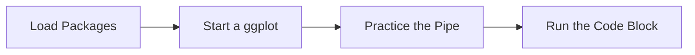

This tutorial complements `39_evaluation_pareto_prioritization.R` and unpacks the workshop on pareto prioritization workshop. You will see how it advances the Evaluation sequence while building confidence with base R and tidyverse tooling.

## Setup

- Ensure you have opened the `archr` project root (or set your working directory there) before running any code.
- Open the workshop script in RStudio so you can execute lines interactively with `Ctrl+Enter` or `Cmd+Enter`.
- Create a fresh R session to avoid conflicts with leftover objects from earlier workshops.

## Skills

- Navigate the script `39_evaluation_pareto_prioritization.R` within the Evaluation module.
- Connect the topic "Pareto prioritization workshop" to systems architecting decisions.
- Install any required packages highlighted with `install.packages()`.
- Load packages with `library()` and verify they attach without warnings.
- Chain tidyverse verbs with `%>%` to explore stakeholder or architecture tables.
- Iterate on visualisations built with `ggplot2`.

## Process Overview




## Application

### Step 1 – Load Packages

0. SETUP ##################################. Attach dplyr to make its functions available.

```{r step_01, eval=FALSE}
library(dplyr)
library(archr)
library(ggplot2)
# Let's run this script,
# getting a data.frame of architectures `archs`
# with `cost`, `benefit`, and `risk` metrics
source("workshops/08_architecting_metric_design.R")
```

### Step 2 – Run the Code Block

Here's a new function - it's actually the same as archr::pareto(), just with a light adjustment to the very last line. archr::pareto() turns the pareto rank into TRUE/FALSE this pareto_rank() function just returns the raw pareto ranks.

```{r step_02, eval=FALSE}
source("workshops/00_pareto_rank_utilities.R")
```

### Step 3 – Practice the Pipe

Let's get the pareto front (TRUE / FALSE).

```{r step_03, eval=FALSE}
archs = archs %>% mutate(front = pareto(x = cost, y = -benefit))
# Then, let's get the pareto rank (0, 1,2,3,... infinity)
archs = archs %>% mutate(rank = pareto_rank(x = cost, y = -benefit))
```

### Step 4 – Practice the Pipe

Use the `%>%` operator to pass each result to the next tidyverse verb.

```{r step_04, eval=FALSE}
archs %>% glimpse()
```

### Step 5 – Start a ggplot

Visualize! Initialize a ggplot so you can layer geoms and customise aesthetics.

```{r step_05, eval=FALSE}
ggplot() +
  geom_point(data = archs, mapping = aes(
    x = benefit, y = cost,
    color = rank)) +
  geom_line(
    data = archs %>% filter(front == TRUE),
    mapping = aes(x = benefit, y = cost),
    color = "blue") +
  # Add a color scale
  scale_color_gradient(low = "blue", high = "black") +
  # Remember to Label
  labs(x = "Benefit", y = "Cost", color = "Pareto Rank")
```

### Step 6 – Start a ggplot

Initialize a ggplot so you can layer geoms and customise aesthetics.

```{r step_06, eval=FALSE}
ggplot() +
  # Plot the front beneath everything
  geom_line(
    data = archs %>% filter(front == TRUE),
    mapping = aes(x = benefit, y = cost),
    color = "steelblue") +
  # Add a point layer with black, large points
  geom_point(
    data = archs,
    mapping = aes(x = benefit, y = cost),
    color = "black", size = 2) +
  # Add a point layer with color gradient, slightly smaller points.
  geom_point(data = archs, mapping = aes(
    x = benefit, y = cost,
    color = rank), size = 1.5) +
  # Add a color scale
  scale_color_gradient(low = "steelblue", high = "white")  +
  # Remember to Label
  labs(x = "Benefit", y = "Cost", color = "Pareto Rank")
```

### Step 7 – Practice the Pipe

Let's get the pareto front (TRUE / FALSE).

```{r step_07, eval=FALSE}
archs = archs %>% mutate(front = pareto(x = cost, y = -benefit))
# Then, let's get the pareto rank (0, 1,2,3,... infinity)
archs = archs %>% mutate(rank = pareto_rank(x = cost, y = -benefit))
```

### Step 8 – Start a ggplot

Initialize a ggplot so you can layer geoms and customise aesthetics.

```{r step_08, eval=FALSE}
ggplot() +
  # Visuals all points
  geom_point(
    data = archs,
    mapping = aes(x = benefit, y = cost, color = "Others"), size = 2) +
  # Visualize overtop just the Rank < 5 points 
  geom_point(
    data = archs %>% filter(rank < 5),
    mapping = aes(x = benefit, y = cost, color = "Rank < 5"), size = 2) +
  # Visualize overtop just the Rank < 0 points
  geom_point(
    data = archs %>% filter(rank == 0),
    mapping = aes(x = benefit, y = cost, color = "Rank = 0"), size = 2) +
  # Remember to Label
  labs(x = "Benefit", y = "Cost", color = "Pareto Rank")
```

### Step 9 – Practice the Pipe

Let's get the pareto front (TRUE / FALSE).

```{r step_09, eval=FALSE}
archs = archs %>% mutate(front = pareto(x = cost, y = -benefit))
```

### Step 10 – Practice the Pipe

Then, let's get the pareto rank (0, 1,2,3,... infinity).

```{r step_10, eval=FALSE}
archs = archs %>% mutate(rank = pareto_rank(x = cost, y = -benefit))
```

### Step 11 – Start a ggplot

Plot the raw scores - only a good idea if you have a small number of architectures.

```{r step_11, eval=FALSE}
ggplot() +
  # _text puts the numbers, no white outline
  # geom_text(data = archs, mapping = aes(x = benefit, y = cost, label = rank, color = rank))
  # _label puts the numbers with a nice white outline 
  geom_label(data = archs, mapping = aes(x = benefit, y = cost, label = rank, color = rank))
```

### Step 12 – Start a ggplot

You could even try something like earlier, but with labels.

```{r step_12, eval=FALSE}
ggplot() +
  geom_label(
    data = archs, 
    mapping = aes(x = benefit, y = cost, label = rank, fill = "Others"),
    color = "white") +
  geom_label(
    data = archs %>% filter(rank < 10), 
    mapping = aes(x = benefit, y = cost, label = rank, fill = "Rank < 10"),
    color = "white") +
  geom_label(
    data = archs %>% filter(rank < 5), 
    mapping = aes(x = benefit, y = cost, label = rank, fill = "Rank < 5"),
    color = "white") +
  geom_label(
    data = archs %>% filter(rank == 0), 
    mapping = aes(x = benefit, y = cost, label = rank, fill = "Rank = 0"),
    color = "white") +
  # I really like the viridis color scale
  # You'll have to install it first though 
  # run --> install.packages("viridis")
  viridis::scale_fill_viridis(option = "plasma", discrete = TRUE, 
                              begin = 0.2, end = 0.8) +
  # Remember to Label
  labs(x = "Benefit", y = "Cost", fill = "Pareto Rank")
```

### Step 13 – Practice the Pipe

Let's get the pareto front (TRUE / FALSE).

```{r step_13, eval=FALSE}
archs = archs %>% mutate(front = pareto(x = cost, y = -benefit))
# Then, let's get the pareto rank (0, 1,2,3,... infinity)
archs = archs %>% mutate(rank = pareto_rank(x = cost, y = -benefit))
```

### Step 14 – Practice the Pipe

Create an upper threshold line... when rank = 0.

```{r step_14, eval=FALSE}
line0 = archs %>%
  filter(rank == 0) %>%
  group_by(benefit) %>%
  summarize(cost_upper = max(cost),
            type = "Rank = 0")
```

### Step 15 – Practice the Pipe

when rank < 5.

```{r step_15, eval=FALSE}
line5 = archs %>%
  filter(rank < 5) %>%
  group_by(benefit) %>%
  summarize(cost_upper = max(cost),
            type = "Rank < 5")
```

### Step 16 – Practice the Pipe

when rank < 10.

```{r step_16, eval=FALSE}
line10 = archs %>%
  filter(rank < 10) %>%
  group_by(benefit) %>%
  summarize(cost_upper = max(cost),
            type = "Rank < 10")
```

### Step 17 – Create `lines`

Bundle them into one data.frame.

```{r step_17, eval=FALSE}
lines = bind_rows(line0, line5, line10)
```

### Step 18 – Start a ggplot

Visualize! Initialize a ggplot so you can layer geoms and customise aesthetics.

```{r step_18, eval=FALSE}
ggplot() +
  # Plot normal points
  geom_point(data = archs, mapping = aes(
    x = benefit, y = cost)) +
  # Atop them, plot a bunch of lines
  geom_line(data = lines,
            mapping = aes(x = benefit, y = cost_upper,
                          group = type, color = type)) +
  # Remember to Label
  labs(x = "Benefit", y = "Cost", color = "Pareto Rank")
```

### Step 19 – Practice the Pipe

Let's get the pareto front (TRUE / FALSE).

```{r step_19, eval=FALSE}
archs = archs %>% mutate(front = pareto(x = cost, y = -benefit))
# Then, let's get the pareto rank (0, 1,2,3,... infinity)
archs = archs %>% mutate(rank = pareto_rank(x = cost, y = -benefit))
```

### Step 20 – Practice the Pipe

Create an upper threshold line... when rank = 0.

```{r step_20, eval=FALSE}
line0 = archs %>%
  filter(rank == 0) %>%
  group_by(benefit) %>%
  summarize(cost_upper = max(cost),
            type = "Rank = 0")
# when rank < 5
line5 = archs %>%
  filter(rank < 5) %>%
  group_by(benefit) %>%
  summarize(cost_upper = max(cost),
            type = "Rank < 5")
# when rank < 10
line10 = archs %>%
  filter(rank < 10) %>%
  group_by(benefit) %>%
  summarize(cost_upper = max(cost),
            type = "Rank < 10")
# when rank is 10 or more
line10plus = archs %>%
  group_by(benefit) %>%
  summarize(cost_upper = max(cost),
            type = "Rank >= 10")
```

### Step 21 – Start a ggplot

Visualize! Initialize a ggplot so you can layer geoms and customise aesthetics.

```{r step_21, eval=FALSE}
ggplot() +
  # Atop them, plot a bunch of ribbons, 
  # where y is the upper edge and 0 is the lower
```

### Step 22 – Run the Code Block

Atop them, plot a bunch of lines Start with the largest area.

```{r step_22, eval=FALSE}
  geom_ribbon(
    data = line10plus,
    mapping = aes(x = benefit, ymin = 0, ymax = cost_upper, 
                  fill = "Others"), color = "white")  +
  # Overlap the next largest area
  geom_ribbon(
    data = line10,
    mapping = aes(x = benefit, ymin = 0, ymax = cost_upper, 
                  fill = "Rank < 10"), color = "white")  +
  # Next largest area
  geom_ribbon(
    data = line5,
    mapping = aes(x = benefit, ymin = 0, ymax = cost_upper, 
                  fill = "Rank < 5"), color = "white")  +
  # Smallest area
  geom_ribbon(
    data = line0,
    mapping = aes(x = benefit, ymin = 0, ymax = cost_upper,
                  fill = "Rank = 0"), color = "white")  +
  # Plot normal points, with a nice white outline
  geom_point(data = archs, mapping = aes(
      x = benefit, y = cost), color = "white", size = 2)  +
  geom_point(data = archs, mapping = aes(
    x = benefit, y = cost), color = "black", size = 1.5)  +
  # Add a fill scale
  # I really like the viridis color scale
  # You'll have to install it first though 
  # run --> install.packages("viridis")
  viridis::scale_fill_viridis(option = "plasma", discrete = TRUE, begin = 0.2, end = 0.8) +
  # Remember to Label
  labs(x = "Benefit", y = "Cost", fill = "Pareto Rank")
```

## Learning Checks


**Learning Check 1.** Which packages do you install in Step 12, and what must you verify before moving on?

<details>
<summary>Show answer</summary>

Step 12 installs viridis, so make sure each package finishes installing without errors before continuing.

</details>

**Learning Check 2.** Which libraries does Step 1 attach, and why do you run that chunk before others?

<details>
<summary>Show answer</summary>

It attaches dplyr, archr and ggplot2, ensuring their functions are available before you execute the downstream code.

</details>

**Learning Check 3.** After Step 3, what does `archs` capture?

<details>
<summary>Show answer</summary>

It creates `archs` that adds derived columns, and threads the result through a dplyr pipeline. Let's get the pareto front (TRUE / FALSE).

</details>

**Learning Check 4.** After Step 5, what does `x` capture?

<details>
<summary>Show answer</summary>

It creates `x` that filters rows to the cases of interest, and initialises a ggplot visualisation. Visualize! Initialize a ggplot so you can layer geoms and customise aesthetics.

</details>
